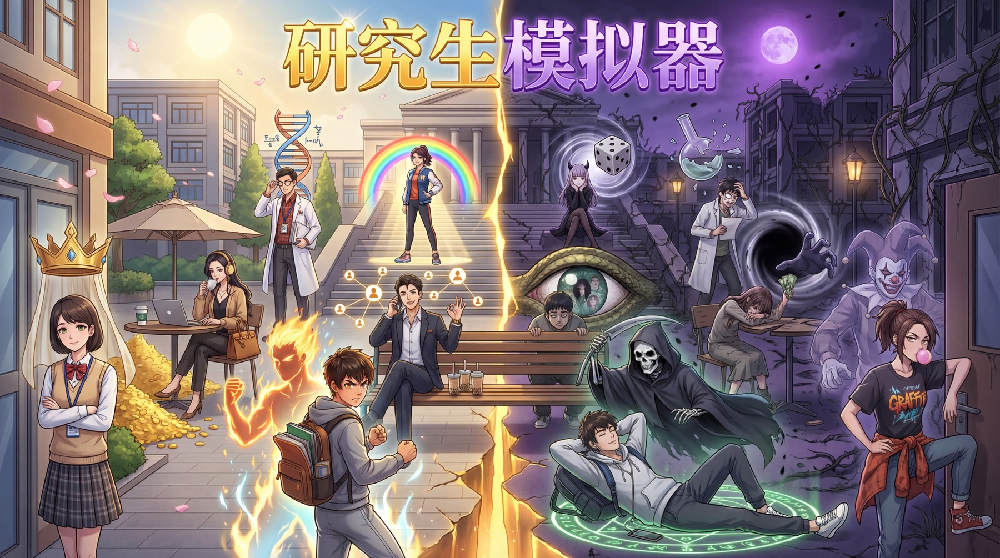

# 🎓 PhD Simulator

一个从 0 开始用 AI 持续迭代的浏览器小游戏。  
体验研究生生涯，在科研、导师、社交、金钱与 SAN 之间做平衡，努力顺利毕业。

[🎮 点击即玩](https://kw66.github.io/PhD_Simulator/) ·
[📝 初始 Prompt](./promopt.txt)

  

## ✨ 项目简介

《研究生模拟器》是一个以研究生科研生活为主题的网页小游戏。  
你需要在有限时间内推进论文、管理 SAN、处理导学关系、维持社交与经济状态，并在不同事件与选择中走向不同结局。

这个项目最初由 AI 根据 prompt 从零生成，之后在真实可玩版本上持续迭代，逐步扩展成一个包含多系统、多事件、多角色、多结局的完整小游戏。

## 🎮 核心玩法

- 硕士阶段需要在 **3 年（36 个月）** 内达到导师要求的科研分。
- 达成条件后可以选择转博，博士阶段需要在 **5 年（60 个月）** 内继续推进毕业目标。
- 游戏中需要平衡：
  - 🧠 SAN 值
  - 🔬 科研能力
  - 👥 社交能力
  - ❤️ 导师好感
  - 💰 金钱资源
- 任一关键属性跌破底线，都可能触发不良结局。

## 🧠 系统亮点

| 系统 | 内容 |
| --- | --- |
| 🎭 角色与模式 | 多个初始角色、正位/逆位设定、隐藏觉醒与差异化成长路线 |
| 📄 论文系统 | 看论文、想 idea、做实验、写论文、投稿、审稿、开会、引用增长 |
| 👨‍🏫 导师系统 | 不同导师有不同毕业要求、资源条件、工资水平与事件分支 |
| 🤝 关系系统 | 同门、学者、恋爱、合作、交流与人脉分支共同影响成长 |
| 🛍️ 商店与 Buff | 装备、消耗品、永久效果、成就币商店、临时与长期增益 |
| 🎲 事件与结局 | 随机事件、固定节点、实习、联合培养、特殊成就与多种结局 |

## 🚀 快速开始

| 方式 | 说明 |
| --- | --- |
| 在线试玩 | 直接打开 [kw66.github.io/PhD_Simulator](https://kw66.github.io/PhD_Simulator/) |
| 本地运行 | 直接用浏览器打开仓库中的 [index.html](./index.html) |
| 历史版本 | 可查看 [gemini.html](./gemini.html)、[index_v0.5.html](./index_v0.5.html)、[index0.html](./index0.html) |

## 🗂️ 仓库结构

| 路径 | 说明 |
| --- | --- |
| [index.html](./index.html) | 当前主版本入口 |
| [css/styles.css](./css/styles.css) | 全局样式与界面视觉 |
| [js/](./js) | 核心逻辑、系统、UI 与各类玩法模块 |
| [promopt.txt](./promopt.txt) | 最初用于生成游戏原型的 prompt |
| [gemini.html](./gemini.html) | 早期 AI 生成版本存档 |
| [index_v0.5.html](./index_v0.5.html) / [index0.html](./index0.html) | 历史快照 |

## 🤖 AI 开发说明

这个项目并不是“一次生成完”的静态产物，而是在 AI 辅助下反复迭代出来的可玩作品。

- 最初版本来自 [promopt.txt](./promopt.txt) 中的 prompt
- 早期尝试保留在 [gemini.html](./gemini.html)
- 后续逐步从单文件原型演进为 `css/ + js/` 的模块化结构
- 近期主要开发与维护工作以 **GPT-5.4** 为主

<strong>📝 开发心得</strong>

### 🚀 2026.4.5

🖼️ Gemini 的生图功能可以进一步优化游戏，也借助一些 UI 优化的 skills 进一步补齐美工上的短板。中转站迭代速度很快，很多都倒闭了，或者人多后服务质量下降。目前 opus 系列不建议用了，贵且不稳定。GPT 有不少羊毛渠道，价格甚至低于电费，但也没有前段时间稳定了。近期开发主要使用 GPT-5.4。

### ⚙️ 2026.2.28

💻 后续用的都是在命令行里调用 GPT、Claude 或者 Gemini，省去了网页端的复制粘贴，可以直接改本地文件，也可以分段读取并修改整个项目（现在已经几万行代码了）。

Claude Opus 4.5 是当时最好用的，后面又出了 4.6，但也是最贵的；网上找了全球 AI 中转或者米醋中转便宜一点。  
GPT 5.2 也不错，但是太慢了。后面出了 GPT 5.3 codex，便宜大碗，可以平替 Claude Opus 4.6，也是找了 codexfor 中转或者 rightcode 中转。  
AI 之间也可以相互调用，需要配置 MCP、skill 等，还装了 [CCswitch](https://github.com/farion1231/cc-switch) 来管理几个中转网站。  
PS：10 天写完博士大论文全靠 Claude！

### 🌱 2025.12.28

🎮 用 AI 从 0 开始制作“研究生模拟器”小游戏。
试了几个 AI，Claude Opus 4.5 最强，无需太多提问技巧，就可以支持这个体量和复杂度的游戏开发，基本能一次跑通，debug 也很在行，缺点是贵。  
Gemini 3 Pro 就差点意思了，功能一复杂就有 bug，关键是 debug 不是很在行，总是信誓旦旦修好了，结果始终不行，还会自作主张修改要求，不太听话。  
DeepSeek 和 Kimi 也稍微尝试了下，总体来说略差于 Gemini。GPT 5.1 也稍微尝试了下，初步感觉和 Gemini 差不多。GPT 5.2 当时还没试。

需要做的就是想好游戏逻辑，提问不要很混乱。最初版本的提问见 [promopt.txt](./promopt.txt)，Gemini 生成的版本见 [gemini.html](./gemini.html)。  
最初大概 3000 行代码，主要用于验证游戏核心功能；后面逐步添加了各种功能，写到了 15000+ 行，再拆分成多个文件整理，随后继续扩展。

